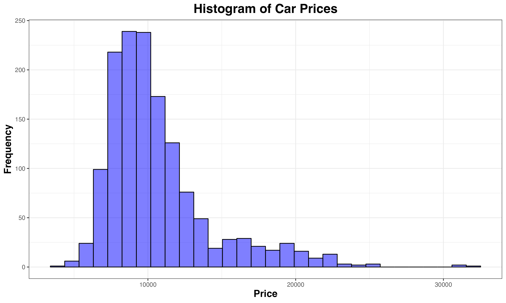
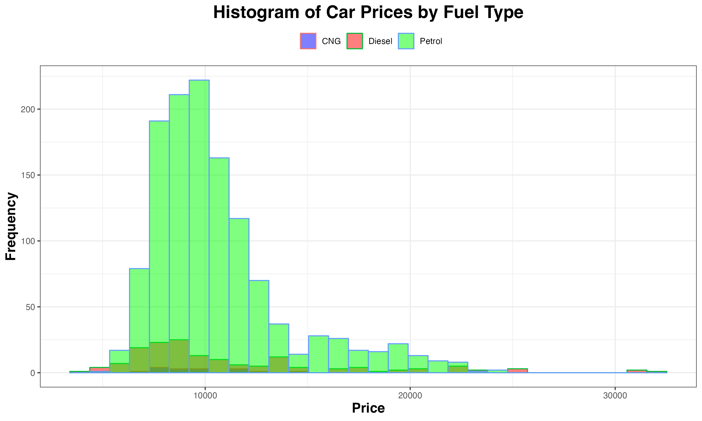
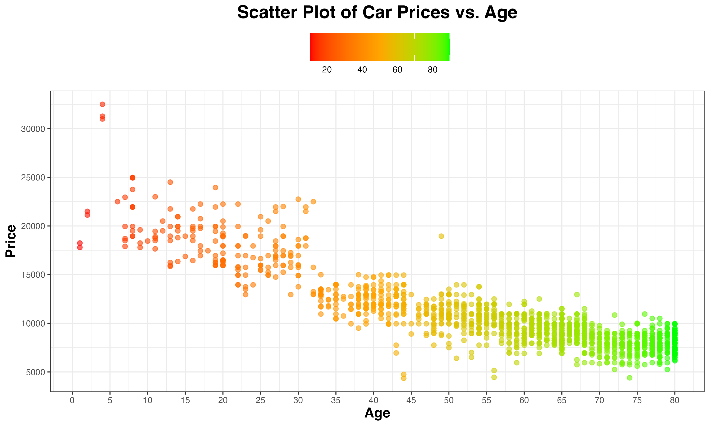
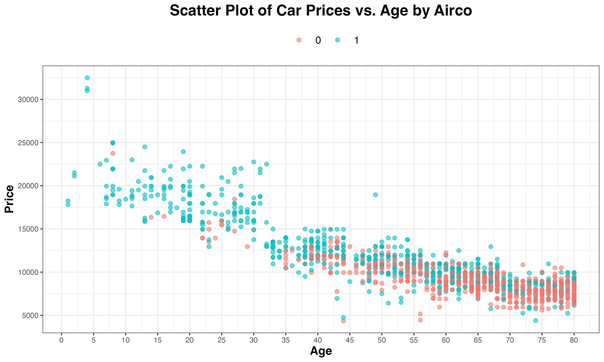
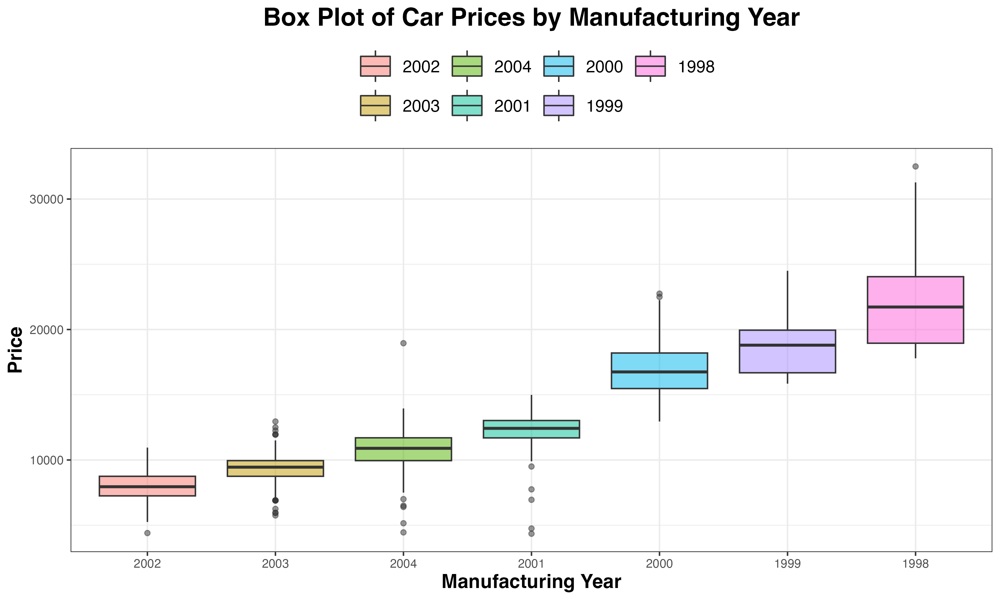

# Car Price Analysis using ggplot2 in R
This repository holds the data analysis for a dataset of approximately 1,400 cars, sold by a European car dealership. The primary objective of this project is to comprehend the relationship between different car characteristics and their respective selling prices.

## Structure of the Directory
```zsh
├── README.md
├── code
│   ├── boxplot_prices_by_year.r
│   ├── histogram_of_prices.r
│   ├── histogram_of_prices_by_fuel_type.r
│   ├── scatterplot_prices_vs_age.r
│   └── scatterplot_prices_vs_age_airco.r
├── data
│   └── car_data.csv
├── figures
│   ├── boxplot_prices_by_year.png
│   ├── histogram_of_prices.png
│   ├── histogram_of_prices_by_fuel_type.png
│   ├── scatterplot_prices_vs_age.png
│   └── scatterplot_prices_vs_age_airco.png
```
* `data/`: Holds the original dataset utilized for the analysis.
* `code/`: Houses the R scripts responsible for generating the data visualizations.
* `figures/`: Stores the figures produced by the analysis.

## Visualizations
The visualizations generated in this project are as follows:
* Histogram of Prices

    

* Histogram of Prices colored by Fuel Type

    

* Scatter Plot of Prices vs. Age

    

* Scatter Plot of Prices vs Age colored by the categorical variable Airco

    

* Box Plot of Prices segregated by Mfg Year

    
